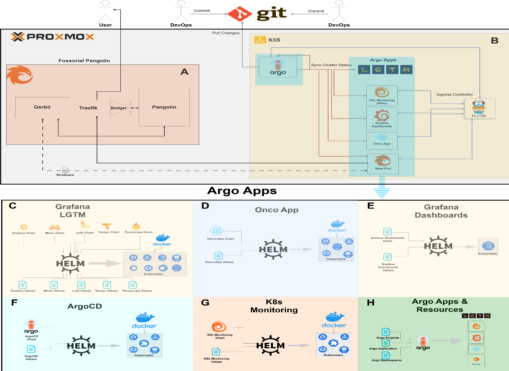

# BEACON: Biomedical Everything-as-Code ON-prem DevSecOps Framework

[](https://doi.org/10.5281/zenodo.17400332)


**Publication:**  
*A DevSecOps framework for biomedical computing: An Everything-as-Code hybrid Proxmox–K3s platform with GitOps automation and adaptive CrowdSec hardening*  
Submitted to .

**DOI:** [10.5281/zenodo.17400332](https://doi.org/10.5281/zenodo.17400332)

---

## Overview
**BEACON (Biomedical Everything-as-Code ON-prem)** provides a reproducible DevSecOps framework integrating:
- **Proxmox VE + K3s orchestration**
- **GitOps automation** via Argo CD
- **Security-as-Code** through CrowdSec (via Pangolin)
- **Observability-as-Code** using Grafana LGTM + Alloy collectors  

This system serves as a lightweight, on-prem blueprint for regulated biomedical workloads and accompanies the FGCS paper cited above.

---

## Quick Start
To explore the project without a full Proxmox setup:

```bash
git clone https://github.com/fabi200123/biomedical-eac-devsecops.git
cd biomedical-eac-devsecops
```

Inspect:
- GitOps definitions under `/argo-apps/`
- Benchmarking script: `/scripts/argocd_rollout_benchmark.py`
- Example manifests: `/testing_app/`
- Output CSVs and plots in `/scripts/`

For full deployment, follow the [docs/reproduction.md](docs/reproduction.md) guide.

---

## Environment Requirements

| Component | Version | Notes |
|------------|----------|-------|
| Proxmox VE | ≥8.3.3 | Host-level virtualization |
| Ubuntu | 24.04 LTS | Guest OS for pangolin / k8s-cluster |
| K3s | v1.32.4 | Single-node cluster |
| Argo CD | Helm chart v7.3.11 | GitOps controller |
| LGTM stack | lgtm-distributed v2.1.0 | Observability |
| Grafana Alloy | via k8s-monitoring v2.0.21 | Collector layer |
| CrowdSec | optional | Default Pangolin scenarios |

---

## Repository Structure

```
biomedical-eac-devsecops/
│
├── argo-apps/                  # Argo CD "App-of-Apps" GitOps definitions
│   ├── charts/                 # Helm chart references for stack components
│   ├── data/                   # Sample manifests and configuration data
│   └── values/                 # Cluster- and app-specific Helm values
│
├── helm/                       # Helm umbrella and values for LGTM, Pangolin, etc.
│   ├── charts/
│   ├── values/
│   └── pangolin/               # Optional CrowdSec + gateway configuration
│
├── scripts/                    # Benchmarking, analysis, and visualization
│   ├── argocd_rollout_benchmark.py   # Main rollout benchmarking script
│   ├── summarize_from_intermediary.py # Aggregates CSV metrics for summary tables
│   ├── plot_generator_abs.py          # Generates rollout and phase plots
│   ├── get_files.ipynb                # Helper notebook for file aggregation
│   └── build_plots.ipynb              # Recreates figures in the paper
│
├── testing_app/                # Minimal demo app for rollout benchmarking
│   ├── backend_deployment.yaml
│   ├── backend_service.yaml
│   ├── frontend_deployment.yaml
│   └── frontend_service.yaml
│
└── README.md                   # Project overview, usage, and citation info
```

---

## Reproducibility Checklist
- [x] IaC, SaC, and ObaC configurations included
- [x] Benchmarking scripts and output data provided
- [x] 24-hour telemetry data reproducible
- [x] Version locks documented
- [x] Figures and tables reproducible from data
- [x] DOI assigned and archived on Zenodo

---

## Citation

If you use **BEACON** in your research, please cite:

> Bozdog, A.-C., Fulga, F., Udrescu, M., & Sîrbu, I.O. (2025).  
> *BEACON: Biomedical Everything-as-Code ON-prem Framework (v1.0.0).*  
> Zenodo. [https://doi.org/10.5281/zenodo.17400332](https://doi.org/10.5281/zenodo.17400332)

---

## License

Licensed under the **Apache License, Version 2.0 (the "License")**;  
you may not use this work except in compliance with the License.  
You may obtain a copy of the License at:  
[http://www.apache.org/licenses/LICENSE-2.0](http://www.apache.org/licenses/LICENSE-2.0)

Unless required by applicable law or agreed to in writing, software distributed under the License is distributed on an **"AS IS" BASIS**,  
without warranties or conditions of any kind, either express or implied.  
See the License for the specific language governing permissions and limitations under the License.


---

## Maintainers
- Alexandru-Cristian Bozdog — [alexandru.bozdog@cs.upt.ro](mailto:alexandru.bozdog@cs.upt.ro)
- Fabian Fulga — [fabian.fulga@upt.ro](mailto:fabian.fulga@upt.ro)

---

<p align="center">
  
</p>

*Figure: Overview of the BEACON architecture integrating Proxmox VE, K3s, Argo CD, CrowdSec, and LGTM (Alloy).*
